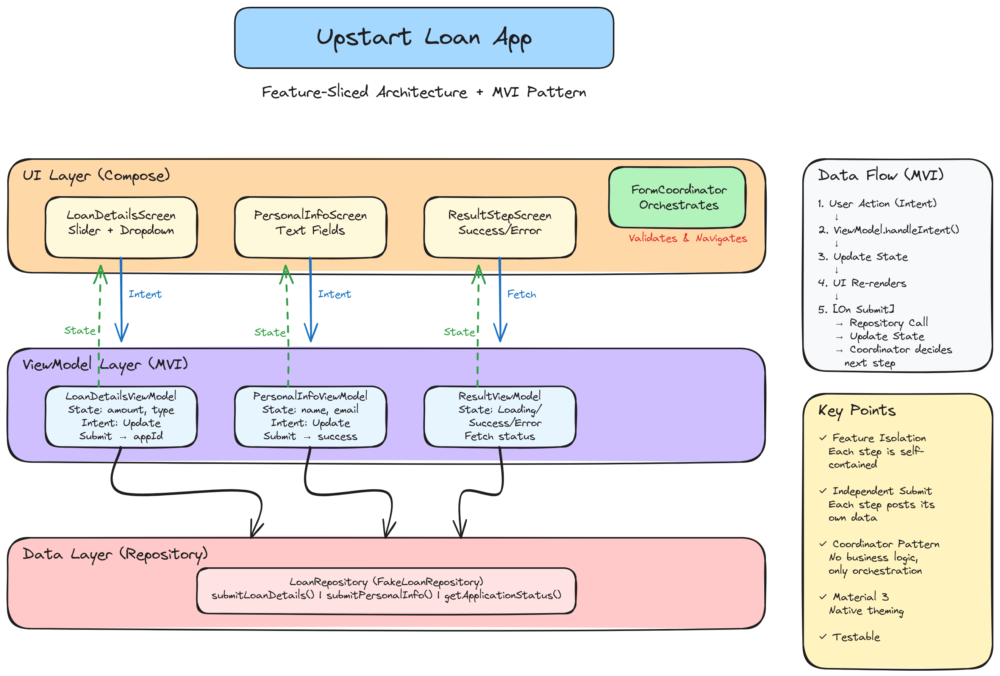

# Upstart Loan Application

A modern Android app demonstrating a multi-step loan application form built with Jetpack Compose and Material Design 3.

## What This App Does

This is a 3-step loan application form that guides users through:

1. **Loan Details** - Select loan amount ($1K-$50K) and loan type (Auto, Mortgage, Personal, etc.)
2. **Personal Information** - Enter name and email
3. **Application Result** - View submission status and application ID

Each step validates input in real-time and submits independently to the backend. Users can navigate back to previous steps, and the entire form can be reset to start over.

The app features:
- **Material 3 Design** - Modern, adaptive UI with light and dark modes
- **Real-time Validation** - Immediate feedback on form errors
- **Step Indicator** - Visual progress through the application
- **Loading States** - Smooth transitions with progress indicators

## Architecture

This app uses a **feature-sliced architecture** with the **MVI (Model-View-Intent) pattern**:



### Key Components

- **Features**: Each form step is a self-contained feature with its own ViewModel and UI
  - `loanDetails` - Amount slider and loan type dropdown
  - `personalInfo` - Name and email text fields
  - `result` - Status display with success/error messages

- **Form Coordinator**: Orchestrates the flow between steps, handles validation, and manages navigation

- **Repository Pattern**: Abstracts data operations (currently using mock implementation)

- **Material 3 Theming**: Full support for light/dark modes with branded colors

### Tech Stack

- **Jetpack Compose** - Modern declarative UI framework
- **Material Design 3** - Latest Material Design components and theming
- **Kotlin Coroutines** - Asynchronous programming
- **StateFlow** - Reactive state management
- **Turbine** - Flow testing library
- **JUnit 4** - Unit testing framework

## Getting Started

### Prerequisites

- Android Studio Hedgehog or newer
- JDK 17
- Android SDK 34 (minimum SDK 24)

### Build and Run

```bash
# Clone the repository
git clone <repository-url>
cd upstartFull

# Build the debug APK
./gradlew assembleDebug

# Install on connected device/emulator
./gradlew installDebug

# Run unit tests
./gradlew test
```

Or simply open the project in Android Studio and click Run ▶️

## 🧪 Testing

The project includes comprehensive unit tests for all business logic:

- **Validators** - All validation rules (email format, min/max values, required fields)
- **ViewModels** - State management, user actions, API submissions
- **Form Coordinator** - Multi-step navigation and validation flow

Run tests with:
```bash
./gradlew test
```

View results at: `app/build/reports/tests/testDebugUnitTest/index.html`

## Features

### Form Validation

- **Amount**: Must be between $1,000 and $50,000
- **Loan Type**: Required selection from 6 options
- **Name Fields**: Minimum 2 characters each
- **Email**: Valid email format (regex validation)

### User Experience

- **Real-time Feedback**: Validation messages appear as you type
- **Smart Navigation**: "Next" button only enabled when current step is valid
- **Error Handling**: Network errors displayed with retry options
- **State Preservation**: Form data survives screen rotations
- **Accessibility**: Full TalkBack support (Material 3 compliance)

### Dark Mode

Complete dark mode support that responds to system settings:
- Automatic theme switching
- Branded colors optimized for both modes
- OLED-friendly dark backgrounds

## 📁 Project Structure

```
app/src/main/java/com/upstart/
├── core/                    # Shared utilities and configuration
│   ├── config/             # App constants
│   ├── form/               # Form interfaces and state
│   ├── models/             # Data models
│   ├── theme/              # Material 3 theming
│   ├── validation/         # Validation logic
│   └── MainActivity.kt     # App entry point
│
├── features/               # Feature modules
│   ├── loanDetails/       # Step 1: Loan amount and type
│   ├── personalInfo/      # Step 2: User information
│   ├── result/            # Step 3: Application result
│   └── form/              # Form coordinator and container
│
└── data/                   # Data layer
    └── repository/         # Data access abstraction
```

## 🎨 Compose Previews

Every screen includes multiple `@Preview` annotations for different states:

- Valid and invalid input states
- Loading states
- Error states
- Disabled states

To view previews in Android Studio:
1. Open any `*Screen.kt` file
2. Click the "Split" view in the top right
3. Browse preview variations

## Configuration

Key configuration values in `core/config/FormConfig.kt`:

```kotlin
MIN_LOAN_AMOUNT = 1000f      // $1,000 minimum
MAX_LOAN_AMOUNT = 50000f     // $50,000 maximum
MIN_NAME_LENGTH = 2          // Characters
```

## Design Patterns Used

- **MVI (Model-View-Intent)** - Unidirectional data flow
- **Feature-Sliced Architecture** - Independent, testable features
- **Repository Pattern** - Data source abstraction
- **Coordinator Pattern** - Flow orchestration without business logic
- **Factory Pattern** - ViewModel instantiation with dependencies
- **State Machine** - Explicit state modeling (Loading, Success, Error)

## How It Works

### Form Flow

1. **User fills out Loan Details**
   - Slides amount selector
   - Picks loan type from dropdown
   - Clicks "Next"

2. **System validates and submits**
   - Validates amount and loan type
   - POSTs loan details to backend
   - Receives application ID
   - Navigates to Personal Info step

3. **User fills out Personal Info**
   - Enters first name, last name, email
   - Clicks "Submit Application"

4. **System processes**
   - Validates all personal info fields
   - POSTs personal info to backend
   - Navigates to Result step

5. **Result screen fetches status**
   - GETs application status using application ID
   - Displays success/failure message
   - Shows "Start Over" button to reset

### Data Submission

Each step submits its data independently:

- **Step 1** → `POST /api/loan-details` → Returns `applicationId`
- **Step 2** → `POST /api/personal-info` → Returns success message
- **Step 3** → `GET /api/status/{applicationId}` → Returns final status

> **Note**: Currently uses `FakeLoanRepository` with simulated delays and 10% random failure rate for testing.

## Learning Points

This project demonstrates:

✅ **Modern Android Development**
- Jetpack Compose for declarative UI
- Material 3 design system
- Kotlin Coroutines for async operations
- StateFlow for reactive state management

✅ **Clean Architecture**
- Separation of concerns
- Testable business logic
- Feature-based organization
- Repository pattern for data access

✅ **Testing Best Practices**
- Unit tests with Turbine for Flow testing
- Mock repositories for isolated testing
- Comprehensive validation testing
- State machine testing

✅ **User Experience**
- Real-time validation feedback
- Loading indicators
- Error handling
- Accessibility support

## 📚 Documentation

- **[AGENTS.md](./AGENTS.md)** - Detailed technical documentation for AI agents
- **Code Comments** - Inline documentation throughout codebase
- **Test Documentation** - Each test describes expected behavior

## License

This is a practice/demonstration project. Use freely for learning purposes.

## Contributing

This is a personal practice project, but suggestions are welcome! Feel free to:

- Open issues for questions or suggestions
- Submit pull requests with improvements
- Use this as a template for your own projects

## Tips for Code Review

When reviewing this code, pay attention to:

1. **State Management** - How StateFlow handles reactive updates
2. **Validation Pattern** - Centralized validators with reusable logic
3. **Testing Strategy** - Turbine for flow testing, mock repositories
4. **Material 3 Integration** - Direct use of ColorScheme (no custom wrapper)
5. **Feature Isolation** - Each feature can be understood independently
