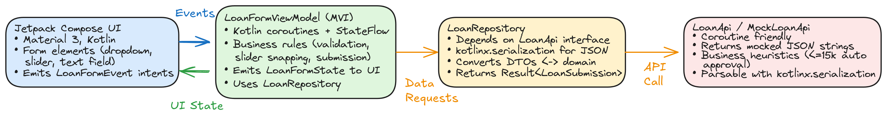

# Upstart Minimal

Lightweight Android Kotlin app showcasing a modern MVI stack built with Jetpack Compose, coroutines, and a mocked JSON API. The main feature is a loan application form (dropdown, slider, text input) that posts to a simulated endpoint, enforces input validation, and emits realistic responses — perfect interview prep to focus on feature work instead of boilerplate.

## Tech Stack
- **Language / Runtime**: Kotlin + coroutines, Kotlin Flow/StateFlow.
- **UI**: Jetpack Compose + Material 3.
- **Architecture**: Single-activity, MVI ViewModel, repository layer, `LoanApi` abstraction (no DI framework).
- **Serialization**: `kotlinx.serialization` for JSON parsing/encoding.
- **Testing**: JUnit4, `kotlinx-coroutines-test`, `MockLoanApi`/`LoanApi` fakes for deterministic coverage.

## Project Structure


```
app/
  src/main/java/com/upstart/minimal/
    MainActivity.kt                 // Hosts Compose content
    data/                           // Repository + DTOs + LoanApi
    domain/                         // Domain models
    ui/form/                        // ViewModel + Compose screens
  src/test/java/com/upstart/minimal/
    data/LoanRepositoryTest.kt
    ui/form/LoanFormViewModelTest.kt
```

## How It Works
1. **UI** (`LoanFormScreen`) observes `LoanFormState` via `collectAsState()` and emits `LoanFormEvent` user intents (purpose selection, slider movement, text entry, submit).
2. **ViewModel** (`LoanFormViewModel`) processes events, snaps slider values to 500 increments, validates borrower name, and calls `LoanRepository`.
3. **Repository** serializes domain objects, calls `LoanApi` (mocked or real), parses JSON responses, and returns `Result<LoanSubmissionResult>`.
4. **Mock API** (`MockLoanApi`) enforces simple business heuristics (≤ 15k auto approval) while guaranteeing JSON round-trip.

## Getting Started
```bash
./gradlew :app:assembleDebug    # Build the APK
./gradlew test                  # Run unit tests
```

Run the app from Android Studio or `adb install` the debug APK. The slider defaults to \$7,500, and values always snap to \$500 increments.

## Tests & Quality
- Repository tests ensure JSON parsing and approval logic are correct.
- ViewModel tests cover validation, slider snapping, and error handling with fake APIs.
- Architecture references: `ARCHITECTURE.md` and `ARCHITECTURE_DIAGRAM.excalidraw`.

## Extending
- Replace `MockLoanApi` with a real implementation by providing another `LoanApi`.
- Add more fields to the form and extend `LoanFormState`.
- Enhance UI with Compose navigation, theming, or persistence as needed.
